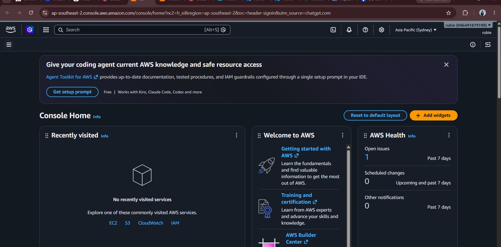

AWS Research

 1. Brief Overview

Amazon Web Services (AWS) is a cloud computing platform that provides many services for computing, storage, databases, networking, security, analytics, and artificial intelligence. AWS allows organizations to build and operate applications using cloud infrastructure without having to maintain all of the physical infrastructure themselves.

 2. Global Infrastructure

AWS has a global infrastructure organized into geographic Regions and Availability Zones (AZs). AWS currently has 39 launched geographic Regions and 123 Availability Zones. Each AWS Region contains multiple physically separate Availability Zones, which helps organizations build applications with high availability, fault tolerance, and scalability.

AWS also provides infrastructure options such as Local Zones and Wavelength Zones for applications that require low latency and services closer to end users.

 3. Cloud Management Console

The AWS Management Console is a web-based interface used to access and manage AWS services and resources. Users can access different AWS service consoles, manage resources, select AWS Regions, monitor their cloud environment, and access account and billing information from the console.

 4. Four Core Services

| AWS Service | Description |
|---|---|
| Amazon EC2 | Provides virtual computing capacity for running applications and workloads. |
| Amazon S3 | Provides scalable object storage for files, backups, data, and applications. |
| Amazon RDS | Provides managed relational database services. |
| Amazon VPC | Allows users to create and manage isolated virtual networks for AWS resources. |

 5. Three Advantages

1. Wide range of services - AWS provides services for computing, storage, databases, networking, security, analytics, artificial intelligence, and many other cloud requirements.

2. Global infrastructure - AWS operates infrastructure across many geographic Regions and Availability Zones, allowing organizations to deploy applications closer to their users and design highly available systems.

3. Scalability and flexibility - AWS allows organizations to increase or decrease resources based on their workload requirements, making it suitable for businesses with changing demands.

 6. Typical Enterprise Use Cases

AWS can be used by enterprises for:

- Web and mobile application hosting
- Data storage and backup
- Database hosting
- Enterprise application modernization
- Data analytics
- Artificial Intelligence and Machine Learning
- Disaster recovery
- Highly available applications
- Global e-commerce systems

7. Screenshot Evidence

The following screenshot shows the AWS Management Console:

Source: Amazon Web Services (AWS)