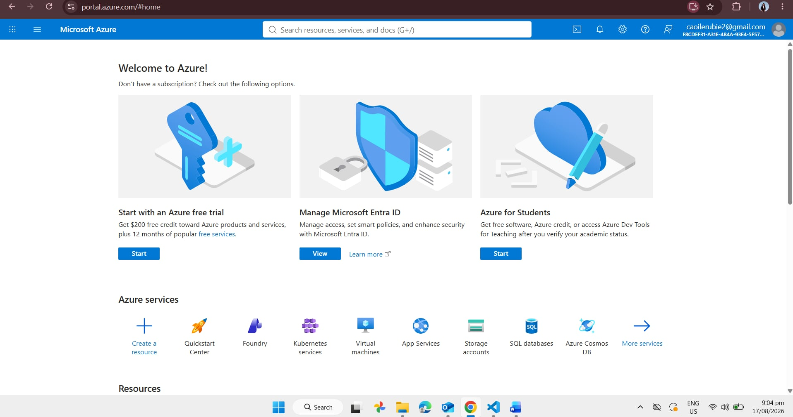

 Microsoft Azure Research

 1. Brief Overview

Microsoft Azure is a cloud computing platform developed by Microsoft. It provides cloud services for computing, storage, databases, networking, security, analytics, artificial intelligence, and application development. Azure allows organizations to build, deploy, manage, and scale applications using Microsoft's global cloud infrastructure.

2. Global Infrastructure

Azure has a global infrastructure made up of geographic regions and data centers. Microsoft currently has more than 70 announced Azure regions, providing organizations with many choices for deploying applications and storing data.

Azure geographies contain one or more regions and are designed to support data residency, compliance, availability, and performance requirements. Azure's global infrastructure allows organizations to place workloads closer to their users.

 3. Cloud Management Console

The Azure Portal is a web-based management console used to build, manage, and monitor Azure applications and resources. It provides a unified interface where users can manage services, view resources, monitor usage, and access cloud management tools.

Azure also provides Cloud Shell, which allows users to manage Azure resources using command-line tools directly from a browser.

 4. Four Core Services

| Azure Service | Description |
|---|---|
| Azure Virtual Machines | Provides virtual machines for running applications and operating systems in the cloud. |
| Azure Blob Storage | Provides scalable object storage for unstructured data such as files, images, videos, and backups. |
| Azure SQL Database | Provides a managed relational database service based on Microsoft SQL Server technology. |
| Microsoft Entra ID | Provides identity and access management for users, applications, and cloud resources. |

 5. Three Advantages

1. Strong Microsoft integration - Azure works closely with Microsoft technologies such as Windows Server, Microsoft 365, Active Directory, and SQL Server.

2. Global infrastructure - Azure provides many regions around the world, allowing organizations to deploy applications closer to their customers and meet data residency requirements.

3. Enterprise capabilities - Azure provides services for security, identity management, databases, artificial intelligence, analytics, application development, and hybrid cloud environments.

 6. Typical Enterprise Use Cases

Azure can be used by enterprises for:

- Windows Server hosting
- Microsoft 365 and Microsoft ecosystem integration
- Enterprise application hosting
- Database management
- Hybrid cloud environments
- Identity and access management
- Artificial Intelligence and Machine Learning
- Data analytics
- Application development
- Disaster recovery

 7. Screenshot Evidence
 

The following screenshot shows the Microsoft Azure official website:

Source: [Microsoft Azure](https://azure.microsoft.com/)