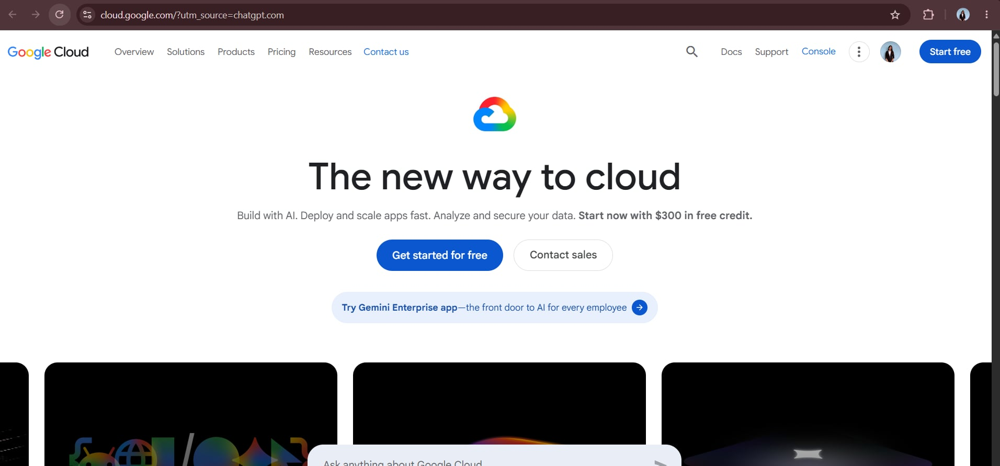

Google Cloud Platform (GCP) Research

 1. Brief Overview

Google Cloud Platform (GCP), commonly called Google Cloud, is a cloud computing platform provided by Google. It offers services for computing, storage, databases, networking, artificial intelligence, machine learning, data analytics, and application development.

Google Cloud allows organizations to build, deploy, and manage applications using Google's global infrastructure and networking technology.

 2. Global Infrastructure

Google Cloud organizes its infrastructure into regions and zones. A region is a geographic area, while zones are deployment areas within a region. Google Cloud currently provides 43 regions and 130 zones across the world.

Google Cloud also operates a global network designed to provide high performance, low latency, and reliable connectivity. Organizations can distribute workloads across regions and zones to improve availability and reduce latency.

 3. Cloud Management Console

The Google Cloud Console is a web-based interface used to create, manage, monitor, and configure Google Cloud resources and services. Users can manage projects, virtual machines, storage, databases, networking, security, and other cloud services through the console.

Google Cloud also provides the Google Cloud CLI and Cloud Shell for users who prefer command-line management.

 4. Four Core Services

| Google Cloud Service | Description |
|---|---|
| Compute Engine | Provides virtual machines for running applications and workloads. |
| Cloud Storage | Provides scalable object storage for files, backups, and other data. |
| Cloud SQL | Provides managed relational databases such as MySQL, PostgreSQL, and SQL Server. |
| Google Kubernetes Engine (GKE) | Provides a managed Kubernetes environment for deploying and managing containerized applications. |

5. Three Advantages

1. Strong Artificial Intelligence and Machine Learning capabilities - Google Cloud provides AI and ML services and specialized infrastructure designed for demanding AI workloads.

2. Kubernetes expertise - Google Cloud provides Google Kubernetes Engine (GKE), a managed Kubernetes service based on Google's experience with container orchestration.

3. Global network infrastructure - Google Cloud operates a large global network that supports low-latency and highly available applications.

 6. Typical Enterprise Use Cases

Google Cloud can be used by enterprises for:

- Artificial Intelligence and Machine Learning
- Big data analytics
- Kubernetes and containerized applications
- Web and application hosting
- Data storage and backup
- Database workloads
- Global applications
- Data processing
- Application modernization
- High-performance computing

 7. Screenshot Evidence
 

The following screenshot shows the Google Cloud official website:

Source: [Google Cloud](https://cloud.google.com/)